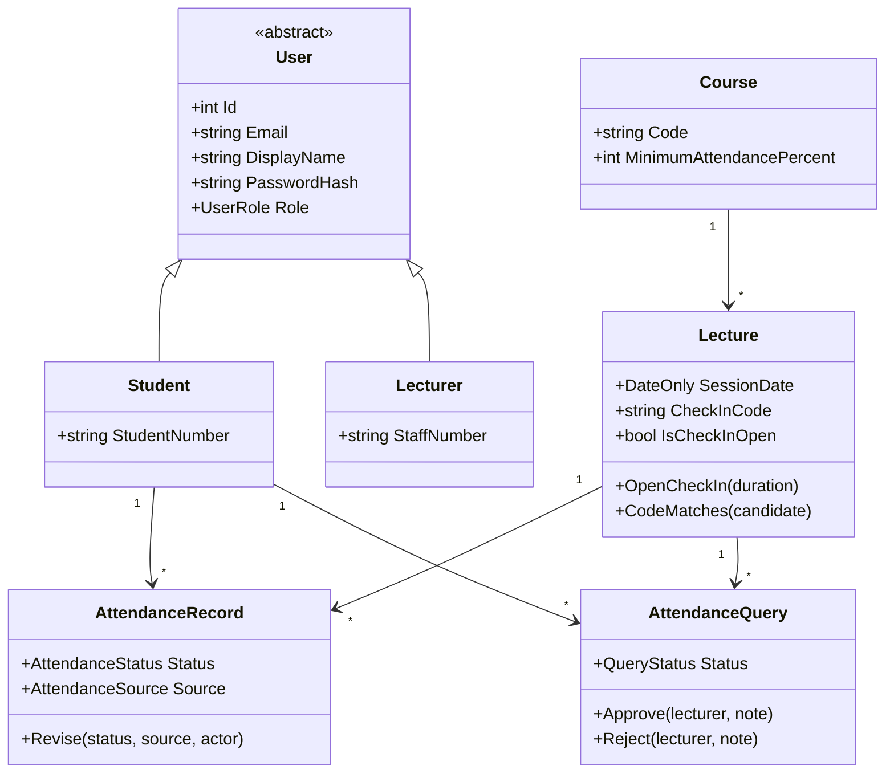

Alessio Munkes MNKALE002

# INF3003W Attendance Register

An ASP.NET Core 8 Razor Pages application that replaces the printed class list,
the tutor's Excel sheet and the manual Amathuba update with one system.

## Running it

```bash
dotnet run
```

Then open the URL Kestrel prints (usually `https://localhost:7xxx`).

The database is SQLite and is created on first run at `App_Data/attendance.db`.
On that first run the bundled class list in `App_Data/seed/` is loaded **through
the real import service**, so the seed path exercises the same code a lecturer
upload does. Delete the `.db` file to start over.

### Demonstration accounts

| Role | Sign in with | Password |
|---|---|---|
| Lecturer | `lecturer@uct.ac.za` | `Lecturer#2026` |
| Student | any student number from the seed file, e.g. `STDNUM001` | `Student#2026` |

Change these in `appsettings.json` 

## What it does

**Students** see their attendance rate against the DP threshold, how many
sessions they can still miss, a session-by-session history, a code box for
recording their own attendance during a lecture, and a query form for anything
that looks wrong.

**Lecturers** upload past registers from a spreadsheet, mark a session by hand,
open and close a timed check-in window, approve or reject queries, see
attendance per session as a chart with the DP line drawn on it, and export the
whole register back to CSV.

## Layout

```
AttendanceRegister/
├── Program.cs                  Composition root: DI, auth, pipeline
├── Infrastructure/             Options, policies, current-user accessor
├── Models/
│   ├── Entities/               Domain classes that own their own rules
│   ├── Enums/
│   ├── Import/                 Format-neutral DTOs for uploads
│   └── ViewModels/             Shapes the pages actually render
├── Data/                       DbContext and first-run seeder
├── Repositories/               IRepository<T>, unit of work, specific repos
├── Services/
│   ├── Abstractions/           Interfaces every page depends on
│   ├── Import/                 Parser strategies, factory, bulk importer
│   └── Security/               PBKDF2 hashing, check-in code generation
├── Pages/
│   ├── Shared/                 Layout and partials
│   ├── Account/                Sign in and out
│   ├── Student/                Dashboard, history, queries
│   └── Lecturer/               Overview, sessions, register, import, queries
├── wwwroot/css/site.css
├── App_Data/seed/              Bundled class list
└── docs/                       Design record, prompt log, UML
```

## Data model



Full PlantUML sources, including the import sequence diagram, are in `docs/uml/`.

## Upload format

One row per student, one column per session date.

| Student Name | Student No | 2026/02/25 | 2026/03/02 |
|---|---|---|---|
| Thandi Mokoena | MKNTHA001 | 1 | 0 |

`1 P Y X` mean present, `0 A N` mean absent, `L` is late, `E` is excused, and an
empty cell is left untouched. Semicolon, comma and tab delimiters are detected
from the header row. `.csv`, `.txt`, `.tsv`, `.xlsx` and `.xlsm` are accepted.

Known limitation: the delimited parser reads line by line, so a quoted field
containing a literal newline is not supported. No register produced by Excel's
CSV export contains one.
